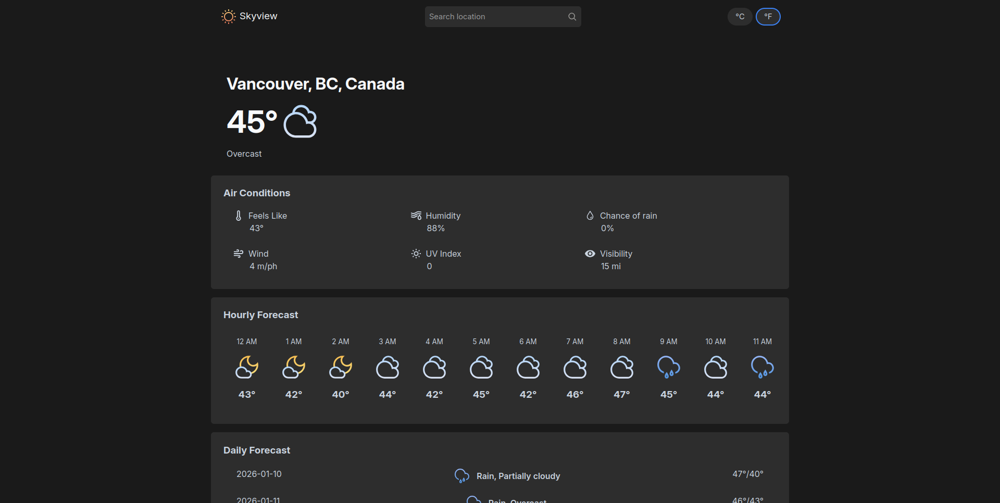

# Skyview Weather App

A weather web app that uses the Visual Crossing Weather API to display current conditions and forecast for any location worldwide.

🔗 **[Live Demo](https://jetfuzz.github.io/weather-app/)**

## Features
* Real-time current weather with temperature, location, and current conditions
* Current air conditions including: feels-like temperature, humidity, chance of rain, wind speed, UV index, and visibility
* Hourly and daily forecasts
* Ability to toggle between Metric and Imperial units 
* User-friendly error handling and responsive design

## Installation
* `git clone https://github.com/jetfuzz/weather-app.git`
* `cd weather-app`
* `npm install`
* `npm run dev`

## Technologies and Tools

* **Frontend:** JavaScript, CSS, HTML
* **Build Tools:** Webpack
* **Code Quality:** Prettier, ESLint
* **API:** Visual Crossing Weather API

## Learning Outcomes

* Used ES6 modules for code organization
* Learned to work with external APIs and handle asynchronous operations
* Used CSS Grid and Flexbox to create responsive layouts
* Implemented error messaging and loading states for better UX

## Attributions

* Built as part of **[The Odin Project](https://www.theodinproject.com/)** curriculum
* Weather icons by **[Leya Cherkasova](https://www.figma.com/community/file/1059229179375580154/weather-icons-kit)**
* SVGs sourced from **[SVG Repo](https://www.svgrepo.com/)**
